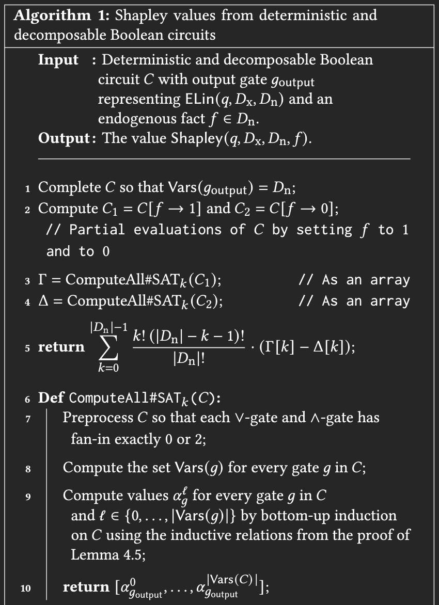
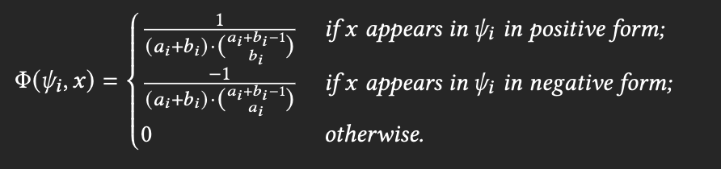
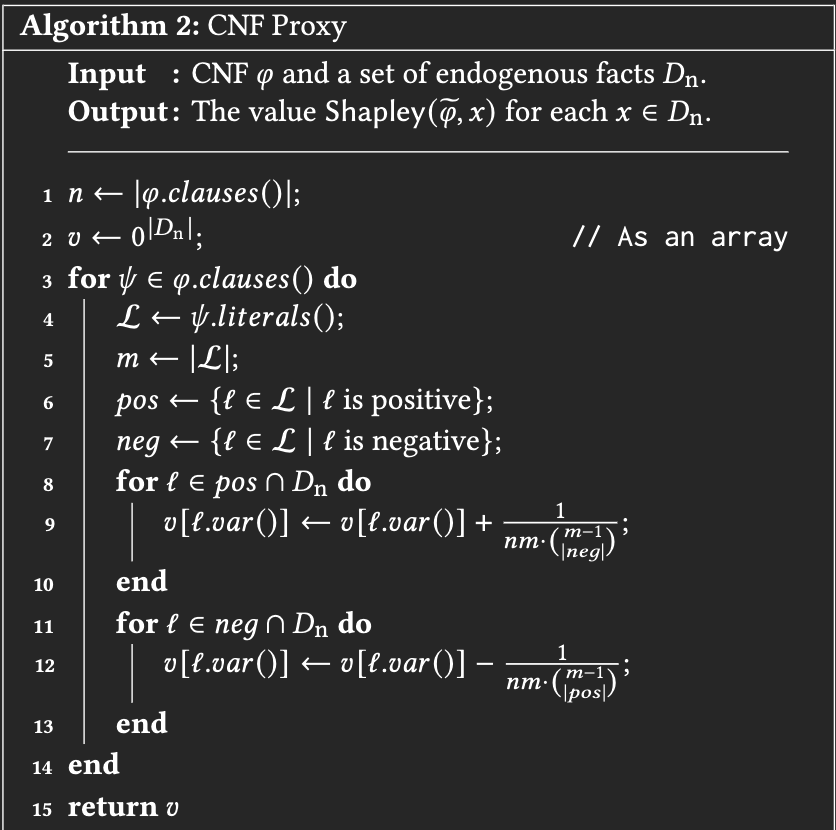

---
# try also 'default' to start simple
theme: default
# random image from a curated Unsplash collection by Anthony
# like them? see https://unsplash.com/collections/94734566/slidev

# apply any windi css classes to the current slide
class: "text-center"
# https://sli.dev/custom/highlighters.html
highlighter: shiki
# show line numbers in code blocks
lineNumbers: false
# some information about the slides, markdown enabled
info: |
  ## Slidev Starter Template
  Presentation slides for developers.

  Learn more at [Sli.dev](https://sli.dev)
# persist drawings in exports and build
drawings:
  persist: false
# page transition
transition: slide-left
# use UnoCSS
css: unocss
---

# Computing the Shapley Value of Facts in query Answering

SIGMOD 22 Session 22: Provenance and Uncertainty

By 钟瑞峥 林俊光

May 10, 2023

---

# Presentation Overview

- **Background**
  - Introduction to Shapley Value
  - General Problems
  - Problems remained in ICDT 2020
- **Solution**
  - Overview
  - Theoretical Analysis
  - Exact Computation
  - Inexact Computation
- **Conclusion**
- **References**

   
   

<!--
haha
-->

## <!-- problesm that are left unsolved in icdt 2020 -->

---

# Background - Shapley Value

Shapley value is a game-theoretic notion for wealth distribution that is nowadays extensively used to explain complex data-intensive computation.

$\begin{aligned} & \operatorname{Shapley}\left(q, D_{\mathrm{n}}, D_{\mathrm{x}}, f\right) \stackrel{\text { def }}{=} \\ & \qquad \sum_{E \subseteq D_{\mathrm{n}} \backslash\{f\}} \frac{|E| !\left(\left|D_{\mathrm{n}}\right|-|E|-1\right) !}{\left|D_{\mathrm{n}}\right| !}\left(q\left(D_{\mathrm{x}} \cup E \cup\{f\}\right)-q\left(D_{\mathrm{x}} \cup E\right)\right)\end{aligned}$

- Research show that query evaluation over relational databases fits well in this explanation paradigm.
- Airport problem

  

    
    <!-- no practical solution to the computational challenge inherent to the computation, two effective solutions for computing -->
    <!-- sol 1. capture the dependence of query answers using boolean expressions and then transform it to a particular circuit form in which we devise an algorithm for computing sp -->
    <!-- sol2. faster yet inexact approach that transforms it into CNF and uses a herustic form to compute the sp -->

---

# Background - Problems in Calculating Shapley Value

- Calculation of the shapley value is NP-hard in general
- The number of possible coalitions is exponential in the number of facts

 
 

### ICDT 2020

- Showed mainly lower bounds on the complexity of computing the Shapley value of facts in query answering
  - gives polynomial-time algorithm for self-join-free conjunctive queries
- Need a large number of executions of the query over database subsets
- Does not provide sufficient evidence

---

# Solution - Overview

### Two Approaches

- Exact Computation
  - Capture the dependence of query answers using boolean expressions
  - Transform it to a d-DNNF circuit form in which we devise an algorithm for computing shapley value
  - May be too costly in certain circumstances

Note: Given a d-DNNF circuit, we can compute the shapley value in polynomial time with the help of c2d and Provsql

- Inexact Computation
  - Not necessarily compute exact Shapley values, determine the order of facts according to their Shapley values
  - Faster yet inexact approach that transforms it into CNF Proxy

<!-- tsetyin? -->

---

# d-DNNF(Decomposable Deterministic Negation Normal Form)

### NNF Definition

- A formula is in NNF if negation only appears in literals

  $(A\vee B)\wedge C$

  $\neg(A\vee \neg C)$

### DNNF Definition

- A formula in NNF is in DNNF form if the decompositional property holds

$(A \wedge B) \vee (A \wedge ((\neg B \vee E)\wedge F)$

---

# d-DNNF(Decomposable Deterministic Negation Normal Form)

### d-DNNF Definition

- A DNNF is called deterministic if operands of a disjunction do not share models

  $(A \wedge B) \vee (A \wedge ((\neg B \vee E)\wedge F)$

  This is not in d-DNNF form as two disjunction operands share the model

  A = 1, B = 1, E = 1, F = 1
  

---

# Solution - Overview

**Shapley value can be computed in polynomial time whenever the query can be evaluated in polynomial time over tuple-independent probablistic databases.**

- Algortihm 1: compiling to a deterministic and decomposable circuit
- Algorithm 2: resort to CNF proxy which is fast yet inexact if timeout reaches
- Hybrid approach: Algorithm 1 + Algorithm 2
  
   
  Note: For non-boolean queries, we are intereseted in the Shapley Value of the fact f for every individual tuple in the output. Therefore, the computational challenge reduces to that of the boolean queries.
   

---

# Tseytin Transformation

- Knowledge Compiler usually takes boolean formulas in CNF form, and not arbitrary boolean circuits.
- Tseytin transformation is a method for converting a boolean circuit into an equisatisfiable CNF formula.
  $((p\vee q) \wedge r)\rightarrow(\neg s)$

  Consider all subformulas(excluding simple variables)
    

    

  $\neg s$

  $p \vee q$

  $(p \vee q) \wedge r$

  $((p \vee q) \wedge r) \rightarrow (\neg s)$
    

    

  $x_1 \leftrightarrow \neg s$

  $x_2 \leftrightarrow p \vee q$

  $x_3 \leftrightarrow x_2 \wedge r$

  $x_4 \leftrightarrow x_3 \rightarrow x_1$

  All substitutions can be transformed into CNF form
  $x_2 \leftrightarrow p \vee q$
  $\equiv (\neg x_2 \vee p \vee q)\wedge (\neg p \vee x_2) \wedge (\neg q \vee x_2)$

    

    

  

---

# Theoretical Analysis - Reduction

  

  
  

  

  
  

 

For every self-join free boolean queries, either q is hierarchical and shapley(q) can be solved in polynomial time, or q is not hierarchical and shapley(q) is intractable

Proposition: For every Boolean query q, we have that Shapley $(q) \leq_{\mathrm{T}}^{\mathrm{p}} \operatorname{PQE}(q)$

Proof:

$\# \operatorname{Slices}\left(q, D_{\mathrm{x}}, D_{\mathrm{n}}, k\right) \stackrel{\text { def }}{=} \mid\left\{E \subseteq D_{\mathrm{n}}|| E \mid=k\right.$ and $\left.q\left(D_{\mathrm{x}} \cup E\right)=1\right\} \mid$.

$\begin{aligned} & \operatorname{Shapley}\left(q, D_{\mathrm{n}}, D_{\mathrm{x}}, f\right)= \\ & \begin{aligned} \sum_{k=0}^{\left|D_{\mathrm{n}}\right|-1} \frac{k !\left(\left|D_{\mathrm{n}}\right|-k-1\right)!}{\left|D_{\mathrm{n}}\right|!}( & \# \operatorname{Slices}\left(q, D_{\mathrm{x}} \cup\{f\}, D_{\mathrm{n}} \backslash\{f\}, k\right)&\left.-\# \operatorname{Slices}\left(q, D_{\mathrm{x}}, D_{\mathrm{n}} \backslash\{f\}, k\right)\right) .\end{aligned}\end{aligned}$

Arithmetic terms can be computed in polynomial time

---

# Theoretical Analysis - Reduction

 
We want to prove that #Slices can be computed in polynomial time

$(1+z)^n \operatorname{Pr}\left(q,\left(D_z, \pi_z\right)\right)=\sum_{i=0}^n z^i \# \operatorname{Slices}\left(q, D_{\mathrm{x}}, D_{\mathrm{n}}, i\right)$

We can now call an oracle to PQE(q) on n+1 databases $D_{z_0}, \ldots, D_{z_n}$ for distinct values $z_0=0, z_1=1, \ldots, z_n=n$.

---

# Exact Computation

Recently, research proved that when the models are given as circuits from knowledge compilation can be computed in polynomial time(SHAP scores).

The same approach can be applied to the computation of Shapley value.

Proposition: Given as input a deterministic and decomposable circuit $C$ representing $\operatorname{ELin}\left(q, D_{\mathrm{n}}, D_{\mathrm{x}}\right)$ for a database $D=D_{\mathrm{X}} \cup$ $D_{\mathrm{n}}$ and Boolean query $q$, and an endogenous fact $f \in D_{\mathrm{n}}$, we can compute in polynomial time (in $|C|)$ the value Shapley $\left(q, D_{\mathrm{n}}, D_{\mathrm{x}}, f\right)$.

We can rewrite the equation as following:

$\begin{aligned} \operatorname{Shapley}\left(q, D_{\mathrm{n}}, D_{\mathrm{x}}, f\right)=\sum_{k=0}^{\left|D_{\mathrm{n}}\right|-1} \frac{k !\left(\left|D_{\mathrm{n}}\right|-k-1\right)}{\left|D_{\mathrm{n}}\right|}(  \left.\text { \#SAT }_k\left(C_1\right)-\# \mathrm{SAT}_k\left(C_2\right)\right) .\end{aligned}$

Lemma: Given as input a d-DNNF Boolean Circuit C, and an integer k, we can compute in polynomial time the quantity $SAT_k(C)$.

---

# Exact Computation

 
Proof: Let X = Vars(C) and n = |X|
We denote by

$\phi_g$ the boolean function over the variables Var(g) that is represented by this gate

$a_l^g$ = $\#SAT_l(\phi_g)$ the number of assignments of size $l$ to Vars(g) that satisfy $\phi_g$

### Variable gate.

- $\alpha_g^0$ is 0 and $\alpha_g^1$ is 1 .
   

### $\neg gate$

- If $g$ is a $\neg$-gate with input gate $g^{\prime}$, then $\alpha_g^{\ell}=\left(\begin{array}{c}|\operatorname{Vars}(g)| \\ l\end{array}\right)-\alpha_{g^{\prime}}^{\ell}$ for every $\ell \in\{0, \ldots,|\operatorname{Vars}(g)|\}$.

---

# Exact Computation

### Deterministic $\vee$-gate

Define $S_1 \stackrel{\text { def }}{=} \operatorname{Vars}\left(g_2\right) \backslash \operatorname{Vars}\left(g_1\right)$ and similarly $S_2 \stackrel{\text { def }}{=} \operatorname{Vars}\left(g_1\right) \backslash$ $\operatorname{Vars}\left(g_2\right)$. Since $g$ is deterministic, we have:

$$
\operatorname{SAT}\left(\varphi_g\right)=\left(\operatorname{SAT}\left(\varphi_{g_1}\right) \otimes 2^{S_1}\right) \cup\left(\operatorname{SAT}\left(\varphi_{g_2}\right) \otimes 2^{S_2}\right)
$$

with the union being disjoint. By intersecting with the assignments of $\operatorname{Vars}(g)$ of size $\ell$, we obtain:

$$
\begin{aligned}
\operatorname{SAT}_{\ell}\left(\varphi_g\right)= & {\left[\left(\operatorname{SAT}\left(\varphi_{g_1}\right) \otimes 2^{S_1}\right) \cap\{v \subseteq \operatorname{Vars}(g)|| v \mid=\ell\}\right] } \\
& \cup\left[\left(\operatorname{SAT}\left(\varphi_{g_2}\right) \otimes 2^{S_2}\right) \cap\{v \subseteq \operatorname{Vars}(g)|| v \mid=\ell\}\right]
\end{aligned}
$$

$$
\begin{aligned}
\# \operatorname{SAT}_{\ell}\left(\varphi_g\right)= & \left|\left(\operatorname{SAT}\left(\varphi_{g_1}\right) \otimes 2^{S_1}\right) \cap\{v \subseteq \operatorname{Vars}(g)|| v \mid=\ell\}\right| \\
& +\left|\left(\operatorname{SAT}\left(\varphi_{g_2}\right) \otimes 2^{S_2}\right) \cap\{v \subseteq \operatorname{Vars}(g)|| v \mid=\ell\}\right|
\end{aligned}
$$

$\left|\left(\operatorname{SAT}\left(\varphi_{g_1}\right) \otimes 2^{S_1}\right) \cap\{v \subseteq \operatorname{Vars}(g)|| v \mid=\ell\}\right|$ =
$
\sum_{i=\max \left(0, \ell-\left|S_1\right|\right)}^{\min \left(\ell, \operatorname{Vars}\left(g_1\right) \mid\right)} \alpha_{g_1}^i \times\left(\begin{array}{c}
\left|S_1\right| \\
\ell-i
\end{array}\right) \text {. }
$

---

# Exact Computation

### Decomposable $\wedge$-gate.

$$
\operatorname{SAT}\left(\varphi_g\right)=\operatorname{SAT}\left(\varphi_{g_1}\right) \otimes \operatorname{SAT}\left(\varphi_{g_2}\right)
$$

We now intersect with the set of assignments of $\operatorname{Vars}(g)$ of size $l$ to obtain

$$
\alpha_g^{\ell}=\# \operatorname{SAT}_{\ell}\left(\varphi_g\right)=\sum_{i=\max \left(0, \ell-\left|\operatorname{Vars}\left(g_2\right)\right|\right)}^{\min \left(\ell,\left|\operatorname{Vars}\left(g_1\right)\right|\right)} \alpha_{g_1}^i \times \alpha_{g_2}^{\ell-i}
$$

---

# Exact Computation

---

# Inexact Computation

 
Based on the observation that having a high shapley score is correlated with

- Appearing many times of the provenance
- Having few alternatives

Shapley $(h, x) \stackrel{\text { def }}{=} \sum_{S \subseteq X \backslash\{x\}} \frac{|S| !(|X|-|S|-1) !}{|X| !}(h(S \cup\{x\})-h(S))$.

---

# Inexact Computation

---

# Conclusion - Experimental Results

- knowledge compilation using the c2d compiler
- datasets
  - TPC-H (removing nested queries and queries with aggregation)
  - IMDB
- Algorithm1 yields an overall 84.43% success rate for TPC-H and 99.96% for IMDB,
- Algorithm2 is very efficient and that the ranking based on CNF proxies is very close to the ranking based on the exact Shapley value
